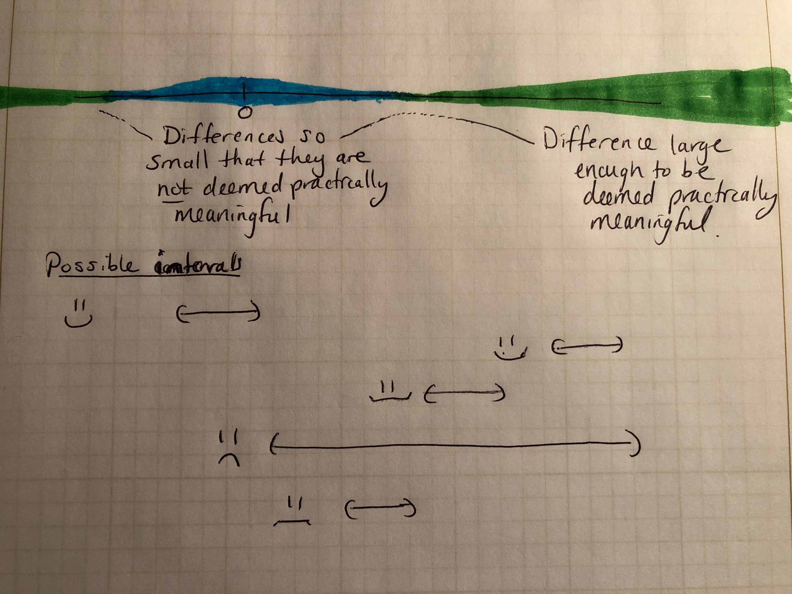

```{r setup, include=FALSE}
knitr::opts_chunk$set(echo = TRUE)
options(show.signif.stars = FALSE)
library(tidyverse) 
library(arm)
library(tidyr)
library(gridExtra)
library(ggridges)
```


## Simulation-Based Model Assessment


### Simulation of Probabilistic Models

Suppose the Colorado Rockies have a talent level that corresponds to winning 50% of their games. What are the reasonable expectation for the number of games the Rockies will win this season (out of 162).
\vfill
Specifically, we are interested in the distribution of outcomes that could be generated, given the Rockies are expected to win 50% of their games?

\vfill
```{r, echo = F}
set.seed(02262020)
rockies_outcome1 <- rbinom(1,162,.5)
```
\vfill
In one scenario, the Rockies could win `r rockies_outcome1`. However, we are interested in the distribution of possible outcomes.

```{r, echo = F}
tibble(wins = replicate(50000, rbinom(1,162,.5))) %>% ggplot(aes(x = wins)) + 
  geom_histogram(aes(y = ..density..),binwidth = 1, fill = 'darkorchid4') +
  ggtitle("Distribution of Wins for Colorado Rockies with 50% win probability") +
  theme_bw()
```

\newpage

We can do the same thing for a continuous variable. Consider the 2020 Super Bowl where the Kansas City Chiefs were 1.5 point favorites. Assume that this point differential can be translated to a normal distribution with standard deviation of 7.

\vfill

Then the range of possible outcomes can be simulated...
\vfill
```{r, echo = F}
points <- tibble(points = rnorm(50000, 1.5, 7))
points %>% ggplot(aes(x = points)) +
  geom_histogram(aes(y = ..density..), binwidth = 1) + 
  ggtitle("Simulated Point Spread for 2020 Super Bowl in Favor of KC") +
  theme_bw() + geom_vline(xintercept = 0, color = 'darkred') + 
  annotate("text",label='Chiefs Win', x=20, y=.04) + 
  annotate('segment',x = 20, y = .035, xend = 5, yend= .03, arrow = arrow()) +
  annotate("text",label='49ers Win', x=-20, y=.04) + 
  annotate('segment',x = -20, y = .035, xend = -5, yend= .03, arrow = arrow())
```
\vfill
This can also be used to calculate the winning probability (under the assumed model), where the Chiefs would win with probability `

\newpage

## Summarizing linear regression with simulation 

```{r, message = F}
set.seed(02262020)
beer <- read_csv('http://math.montana.edu/ahoegh/Data/Brazil_cerveja.csv') %>% 
  mutate(precip = scale(precip), max_tmp = scale(max_tmp))

lm_beer <- lm(consumed~ precip + max_tmp + weekend , data = beer)
display(lm_beer)
```

Confidence intervals can be analytically computed... (but still require distributional assumptions or CLT asymptotics)
```{r}
confint(lm_beer)
```

Simulation can also be used construct intervals
```{r}
n.sims <- 1000
sim_vals <- arm::sim(lm_beer, n.sims )
head(coef(sim_vals))

ci <- apply(coef(sim_vals),2, quantile, probs = c(.025, .975))  # simulation from arm package
round(ci,2)
```
\newpage

```{r}
tibble(var = colnames(coef(sim_vals)), lower = as.numeric(ci[1,]), upper = as.numeric(ci[2,])) %>%
  ggplot() + geom_segment(aes(x=lower, xend = upper, y = var, yend = var)) + 
  ggtitle("Confidence Intervals for Standardized Coefficients \n Modeling Beer Consumption") +
  xlab('liters of beer') + theme_bw() + ylab('') + 
  scale_y_discrete(labels = c('Intercept','Maximum \n Temperature','Precipitation','Weekend'))  

```

\vfill

Interpret this figure and explain the results to an owner of a liqour store.

\vfill

As an aside, Megan Higgs has a blog about critical thinking in statistical inference (critical inference). You should read it [https://critical-inference.com//](https://critical-inference.com/). Here is an image from a discussion about power, see ([https://critical-inference.com/sample-size-without-power-yes-its-possible/]https://critical-inference.com/sample-size-without-power-yes-its-possible/




\newpage

### Simulation for predictive inference

Suppose the liquour store owner is interested in the following results:

1. the mean predicted consumption on a weekend with average precipitation and temperature 1 sd greater than average.
\vfill

2. the mean predicted consumption on a week day with average precipitation and temperature 1 sd less than average.
\vfill

3. the mean predicted difference in consumption between the two days specified in point 1 and point 2.
\vfill

Answering these questions is easy with simulation...
```{r, message = F, echo = F}
pred1 <- coef(sim_vals) %*% matrix(c(1,0,1,1),nrow =4, ncol = 1)
pred2 <- coef(sim_vals) %*% matrix(c(1,0,-1,0),nrow =4, ncol = 1)
pred3 <- pred1 - pred2
```

```{r, message = F}

post_plot <- tibble( values = c(pred1, pred2, pred3), type = rep(c('pred1','pred2','pred3'),
                                                                 each = n.sims)) %>% 
  ggplot(aes(x = values, y = type, fill = type)) + geom_density_ridges2(scale = 1) + 
  scale_y_discrete(expand = c(0.01, .01,0.01,.7)) + ggtitle('Average Predicted Beer Consumption in Brazil') + 
  ylab('') + xlab('liters of beer') + 
  annotate('text',label = 'Day Type 1: Weekend \n Average Precipitation \n Max Temp 1 SD > average ',
           x=25, y = 1.5) + 
  annotate('rect',xmin = 21,xmax = 29, ymin = 1.25, ymax = 1.75, alpha = .2) + 
  theme_bw() + theme(axis.text.y = element_blank(),axis.ticks.y = element_blank(),
                     legend.position = "none") +
  annotate('segment', x=29, xend = 31.9, y = 1.5, yend=1.3,arrow = arrow()) +
  annotate('rect', xmin = 11,xmax = 19, ymin = 2.25, ymax = 2.75, alpha = .2) + 
  annotate('segment', x=19, xend = 21, y = 2.5, yend=2.3,arrow = arrow()) +
  annotate('text',label = 'Day Type 2: Weekday \n Average Precipitation \n Max Temp 1 SD < average ',
           x=15, y = 2.5) +
   annotate('rect', xmin = 15,xmax = 23, ymin = 3.2, ymax = 3.6, alpha = .2) + 
  annotate('segment', x=15, xend = 11, y =3.4, yend=3.2,arrow = arrow()) +
  annotate('text',label = 'Day Type 1 - Day Type 2 ',x=19, y = 3.4) +
  scale_fill_manual(values = c("#00AFBB", "#E7B800", "#FC4E07"))
```

\newpage

```{r, message = F}
post_plot
```

\vfill 
So what exactly is the "mean predicted consumption..."? Does this correspond to predictions for a single day?

\vfill

Put another way what does the uncertainty in these density plots correspond to?
\vfill

```{r, message = F}
post_plot + 
  geom_rug(inherit.aes = F, data = beer %>% filter(weekend ==1 & max_tmp > .9 & max_tmp < 1.1), 
           aes(x = consumed, y = NULL), sides = 'b', colour = "#00AFBB") +
  geom_rug(inherit.aes = F, data = beer %>% filter(weekend ==0  & max_tmp < -.9 & max_tmp > -1.1), 
           aes(x = consumed, y = NULL), sides = 'b', colour = "#E7B800") 
```

### Prediction for a single data point

Our model for a single data point is
\vfill
\vfill

```{r}
pred1_indiv <- rnorm(n = n.sims, mean = pred1, sd = sigma.hat(sim_vals) )
pred2_indiv <- rnorm(n = n.sims, mean = pred2, sd = sigma.hat(sim_vals) )
pred3_indiv <- pred1_indiv - pred2_indiv
```

\newpage

```{r, message = F, echo = F}
tibble( values = c(pred1_indiv, pred2_indiv, pred3_indiv), type = rep(c('pred1','pred2','pred3'),
                                                                 each = n.sims)) %>% 
  ggplot(aes(x = values, y = type, fill = type)) + geom_density_ridges2(scale = 1) + 
  scale_y_discrete(expand = c(0.01, .01,0.01,.7)) + ggtitle('Daily Predicted Beer Consumption in Brazil') + 
  ylab('') + xlab('liters of beer') + 
  annotate('text',label = 'Day Type 1: Weekend \n Average Precipitation \n Max Temp 1 SD > average ',
           x=20, y = 1.5) + 
  annotate('rect',xmin = 13,xmax = 27, ymin = 1.25, ymax = 1.75, alpha = .2) + 
  theme_bw() + theme(axis.text.y = element_blank(),axis.ticks.y = element_blank(),
                     legend.position = "none") +
  annotate('segment', x=27, xend = 31.9, y = 1.5, yend=1.3,arrow = arrow()) +
  annotate('rect', xmin = 3,xmax = 17, ymin = 2.25, ymax = 2.75, alpha = .2) + 
  annotate('segment', x=17, xend = 21, y = 2.5, yend=2.3,arrow = arrow()) +
  annotate('text',label = 'Day Type 2: Weekday \n Average Precipitation \n Max Temp 1 SD < average ',
           x=10, y = 2.5) +
   annotate('rect', xmin = 17,xmax = 31, ymin = 3.2, ymax = 3.6, alpha = .2) + 
  annotate('segment', x=17, xend = 11, y =3.4, yend=3.2,arrow = arrow()) +
  annotate('text',label = 'Day Type 1 - Day Type 2 ',x=24, y = 3.4) +
  scale_fill_manual(values = c("#00AFBB", "#E7B800", "#FC4E07")) + 
  geom_rug(inherit.aes = F, data = beer %>% filter(weekend ==1 & max_tmp > .9 & max_tmp < 1.1), 
           aes(x = consumed, y = NULL), sides = 'b', colour = "#00AFBB") +
  geom_rug(inherit.aes = F, data = beer %>% filter(weekend ==0  & max_tmp < -.9 & max_tmp > -1.1), 
           aes(x = consumed, y = NULL), sides = 'b', colour = "#E7B800") 
```


### Simulation Procedure
Simulation can be conducted using the `sim()` function in `arm`
\vfill

1. Use classical regression of the $n$ data points with $k$ predictors to compute the estimate of regression coefficents
\vfill
\vfill
2. For each of the `n.sims` iterations, create the coefficient vector $\underline{\hat{\beta}}^{iter}$ and residual standard deviation $\hat{\sigma}^{iter}$.

a. $\hat{\sigma}^{iter} =$
\vfill
b. $\underline{\hat{\beta}}^{iter} \sim$

\vfill

Note: this is referred to as 
